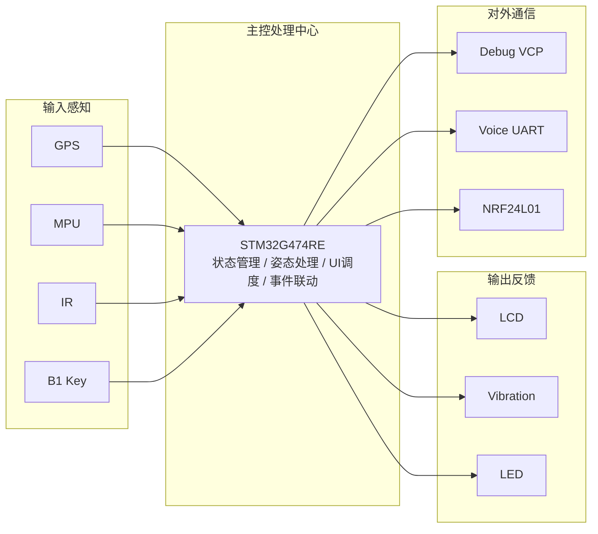
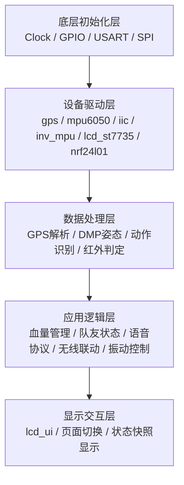

# CS战术护甲系统

`CS Tactical Armor System` 是一套基于 `STM32G474RE` 的多传感融合战术交互终端原型。  
系统围绕“状态感知、事件判定、本地反馈与节点通信”四条主线展开，将惯性姿态、GPS 定位、红外受击、LCD 显示、振动反馈、语音串口交互和 `NRF24L01` 无线通信集成在同一套嵌入式工程中。

本仓库提供的是当前可公开版本的工程整理包，包含：

- 完整 `STM32G474` 工程源码
- `STM32CubeMX` 工程文件
- `Keil MDK` 工程文件
- 硬件资源说明
- 软件结构图与数据流图
- GitHub 上传说明

## 一、项目定位

这不是单一外设例程，也不是简单的传感器拼接实验，而是一套完整的小型嵌入式系统原型。  
主控芯片不仅负责采样和驱动，更承担数据解释、状态组织、事件联动和界面输出，因此整套系统更接近“可展示、可继续扩展、可继续工程化”的作品，而不是单一功能测试代码。

## 二、核心功能

- 红外受击检测与命中计数
- 生命值管理与受击联动
- 振动马达本地触觉反馈
- `MPU6050/MPU6500-class` 惯性数据读取
- `DMP` 姿态解算，输出 `Pitch / Roll / Yaw`
- 动作状态识别，输出 `STATIC / MOVE`
- GPS 串口解析、定位状态识别与速度滤波
- `ST7735` LCD 四页面显示
- `USART1` 语音模块交互
- `NRF24L01` 无线状态同步
- 板载按键翻页与板载 LED 心跳指示

## 三、硬件平台

当前工程基于以下平台搭建：

| 项目 | 说明 |
| --- | --- |
| 主控板 | `NUCLEO-G474RE` |
| MCU | `STM32G474RE` |
| 主频 | `170 MHz` |
| 调试方式 | 板载 `ST-LINK` + VCP |
| 屏幕 | `ST7735 1.8" 128x160 TFT LCD` |
| 惯性模块 | `MPU6050 / MPU6500-class` |
| 定位模块 | GPS 串口模块 |
| 无线模块 | `NRF24L01` |
| 反馈模块 | 振动马达 |

## 四、关键引脚分配

| 功能 | 外设/方式 | 引脚 |
| --- | --- | --- |
| 调试串口 | 板载 VCP | `PA2/PA3` |
| 板载 LED | GPIO | `PA5` |
| 外置/板载按键 | `B1` / EXTI | `PC13` |
| 振动马达控制 | GPIO | `PA8` |
| 语音模块 | `USART1` | `PA9/PA10` |
| GPS 模块 | `USART3` | `PB10/PB11` |
| MPU 惯性模块 | 软件 `I2C` | `PB6/PB7` |
| 红外接收 | GPIO 输入 | `PB9` |
| LCD 屏幕 | `SPI2 + GPIO` | `PB12/PB13/PB15/PC6/PC7` |
| NRF24L01 | `SPI3 + GPIO` | `PC10/PC11/PC12/PA4/PB0/PB1` |

更详细的接线说明请看 [docs/hardware-resources.md](docs/hardware-resources.md)。

## 五、系统总览



## 六、软件结构



## 七、仓库结构

```text
CS_Tactical_Armor_System_OpenSource/
├─ README.md
├─ .gitignore
├─ GITHUB_UPLOAD_GUIDE.md
├─ docs/
│  ├─ hardware-resources.md
│  ├─ hardware-mermaid.md
│  ├─ software-mermaid.md
│  └─ system-mermaid.md
└─ firmware/
   ├─ .mxproject
   ├─ myproject_G474_base.ioc
   ├─ Core/
   ├─ Drivers/
   └─ MDK-ARM/
      ├─ myproject_G474_base.uvprojx
      ├─ startup_stm32g474xx.s
      ├─ stm32g474xx_flash.sct
      └─ RTE/
```

## 八、如何编译与下载

### 1. 使用 Keil 编译

打开：

`firmware/MDK-ARM/myproject_G474_base.uvprojx`

然后执行：

1. 选择目标工程 `myproject_G474_base`
2. 点击 `Rebuild`
3. 连接 `ST-LINK`
4. 点击 `Download`

### 2. 使用 CubeMX 查看或修改底层配置

打开：

`firmware/myproject_G474_base.ioc`

当前工程对应环境为：

| 工具 | 版本 |
| --- | --- |
| `STM32CubeMX` | `6.15.0` |
| `STM32Cube FW_G4` | `V1.6.3` |
| `Keil MDK` | `V5.32` |
| 编译器 | `ARM Compiler 5.06 update 7` |

## 九、当前已知说明

### 1. LCD 默认方向

当前版本已经将 `ST7735` 的默认旋转方向设置为 `180°`，原因是实物屏幕采用倒装固定方式。  
因此如果你的屏幕也是倒着固定的，可以直接使用当前版本；如果你的屏幕是正装，则可以在 `lcd_st7735.h` 中调整默认旋转方向。

### 2. B1 按键扩展

当前翻页按键为板载 `B1`，对应 `PC13`。  
如果需要外接一个按钮并保持程序不变，可以将外置按键并到 `PC13`，按下时让 `PC13` 变为高电平即可。

### 3. 振动马达驱动

`PA8` 只建议作为控制信号输出，实际驱动振动马达时建议使用三极管或 MOSFET，不建议 MCU 直接带电机。

## 十、文档索引

- [硬件资源说明](docs/hardware-resources.md)
- [Mermaid 硬件架构图](docs/hardware-mermaid.md)
- [Mermaid 软件架构图](docs/software-mermaid.md)
- [Mermaid 系统总览与数据流图](docs/system-mermaid.md)


## 十一、致谢

本工程使用了 `STM32 HAL` 相关基础库，并结合 `DMP` 姿态处理相关代码完成系统构建。  
同时感谢 `STM32CubeMX`、`Keil MDK` 和 `NUCLEO-G474RE` 平台为项目开发提供的工程基础。
