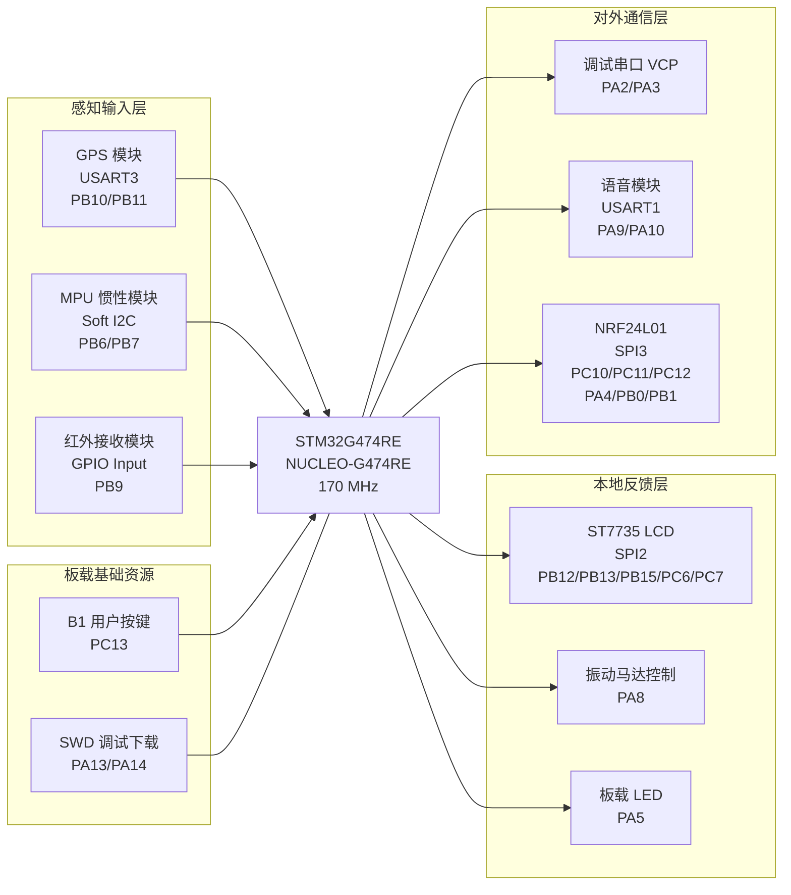
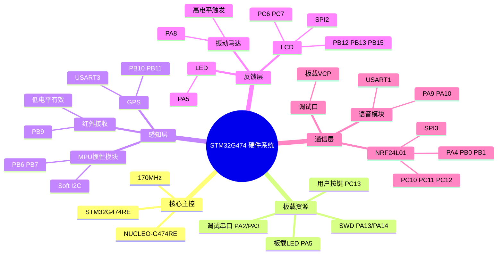
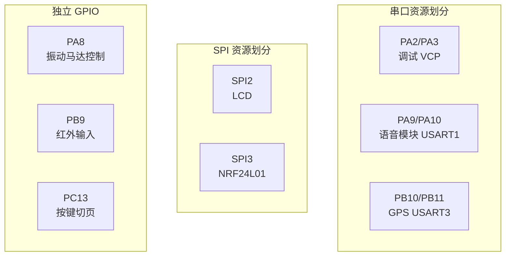

# Mermaid 硬件架构图

下面这份是 `Mermaid` 版硬件架构图，适合在支持 `Mermaid` 的 Markdown 查看器中直接渲染。

## 一、硬件总览图

```mermaid
flowchart LR
    MCU["STM32G474RE<br/>NUCLEO-G474RE<br/>170 MHz"]

    subgraph Input["感知输入层"]
        GPS["GPS 模块<br/>USART3<br/>PB10/PB11"]
        MPU["MPU 惯性模块<br/>Soft I2C<br/>PB6/PB7"]
        IR["红外接收模块<br/>GPIO Input<br/>PB9"]
    end

    subgraph Output["本地反馈层"]
        LCD["ST7735 LCD<br/>SPI2<br/>PB12/PB13/PB15/PC6/PC7"]
        VIB["振动马达控制<br/>PA8"]
        LED["板载 LED<br/>PA5"]
    end

    subgraph Comm["对外通信层"]
        DBG["调试串口 VCP<br/>PA2/PA3"]
        VOICE["语音模块<br/>USART1<br/>PA9/PA10"]
        NRF["NRF24L01<br/>SPI3<br/>PC10/PC11/PC12<br/>PA4/PB0/PB1"]
    end

    subgraph Board["板载基础资源"]
        KEY["B1 用户按键<br/>PC13"]
        SWD["SWD 调试下载<br/>PA13/PA14"]
    end

    GPS --> MCU
    MPU --> MCU
    IR --> MCU
    KEY --> MCU

    MCU --> LCD
    MCU --> VIB
    MCU --> LED
    MCU --> DBG
    MCU --> VOICE
    MCU --> NRF
    SWD --- MCU
```

## 二、硬件分层思维导图

```mermaid
mindmap
  root((STM32G474 硬件系统))
    核心主控
      STM32G474RE
      NUCLEO-G474RE
      170MHz
    板载资源
      调试串口 PA2/PA3
      板载LED PA5
      用户按键 PC13
      SWD PA13/PA14
    感知层
      GPS
        USART3
        PB10 PB11
      MPU惯性模块
        Soft I2C
        PB6 PB7
      红外接收
        PB9
        低电平有效
    反馈层
      LCD
        SPI2
        PB12 PB13 PB15
        PC6 PC7
      振动马达
        PA8
        高电平触发
      LED
        PA5
    通信层
      调试口
        板载VCP
      语音模块
        USART1
        PA9 PA10
      NRF24L01
        SPI3
        PC10 PC11 PC12
        PA4 PB0 PB1
```

## 三、总线规划图

```mermaid
flowchart TB
    subgraph USART["串口资源划分"]
        U0["PA2/PA3<br/>调试 VCP"]
        U1["PA9/PA10<br/>语音模块 USART1"]
        U3["PB10/PB11<br/>GPS USART3"]
    end

    subgraph SPI["SPI 资源划分"]
        S2["SPI2<br/>LCD"]
        S3["SPI3<br/>NRF24L01"]
    end

    subgraph GPIO["独立 GPIO"]
        G1["PA8<br/>振动马达控制"]
        G2["PB9<br/>红外输入"]
        G3["PC13<br/>按键切页"]
    end
```
