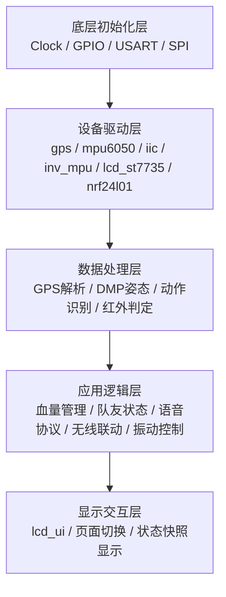
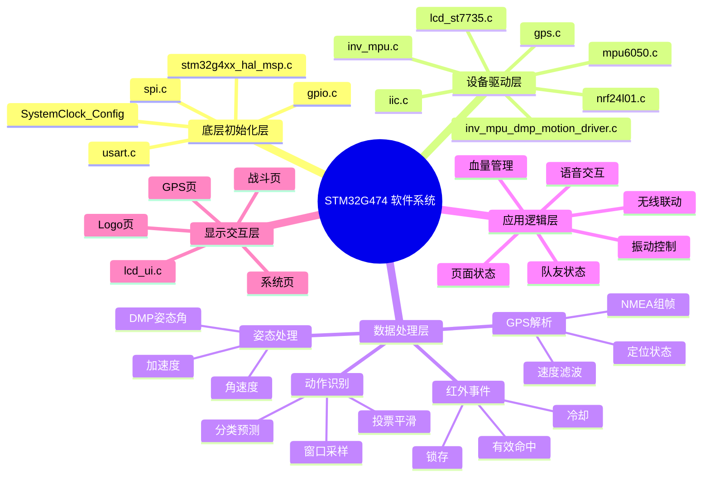
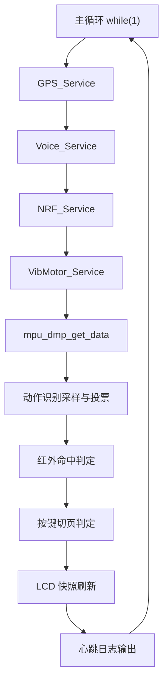
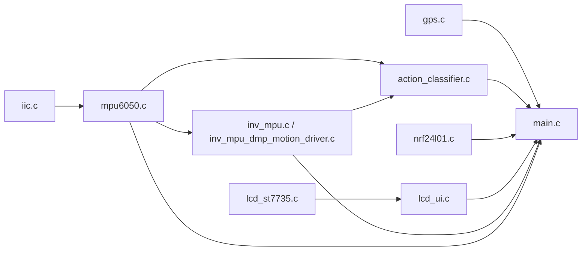

# Mermaid 软件架构图

下面这份是 `Mermaid` 版软件架构图，重点把当前工程的软件层级、模块关系和主循环职责画出来。

## 一、软件分层总览图

```mermaid
flowchart TD
    A["底层初始化层<br/>Clock / GPIO / USART / SPI"]
    B["设备驱动层<br/>gps / mpu6050 / iic / inv_mpu / lcd_st7735 / nrf24l01"]
    C["数据处理层<br/>GPS解析 / DMP姿态 / 动作识别 / 红外判定"]
    D["应用逻辑层<br/>血量管理 / 队友状态 / 语音协议 / 无线联动 / 振动控制"]
    E["显示交互层<br/>lcd_ui / 页面切换 / 状态快照显示"]

    A --> B --> C --> D --> E
```

## 二、软件思维导图

```mermaid
mindmap
  root((STM32G474 软件系统))
    底层初始化层
      SystemClock_Config
      gpio.c
      usart.c
      spi.c
      stm32g4xx_hal_msp.c
    设备驱动层
      gps.c
      iic.c
      mpu6050.c
      inv_mpu.c
      inv_mpu_dmp_motion_driver.c
      lcd_st7735.c
      nrf24l01.c
    数据处理层
      GPS解析
        NMEA组帧
        定位状态
        速度滤波
      姿态处理
        加速度
        角速度
        DMP姿态角
      动作识别
        窗口采样
        分类预测
        投票平滑
      红外事件
        锁存
        冷却
        有效命中
    应用逻辑层
      血量管理
      队友状态
      语音交互
      无线联动
      振动控制
      页面状态
    显示交互层
      lcd_ui.c
      战斗页
      GPS页
      系统页
      Logo页
```

## 三、主循环职责图

```mermaid
flowchart TB
    START["主循环 while(1)"]

    GPS["GPS_Service"]
    VOICE["Voice_Service"]
    NRF["NRF_Service"]
    VIB["VibMotor_Service"]
    DMP["mpu_dmp_get_data"]
    ACT["动作识别采样与投票"]
    IR["红外命中判定"]
    KEY["按键切页判定"]
    LCD["LCD 快照刷新"]
    LOG["心跳日志输出"]

    START --> GPS --> VOICE --> NRF --> VIB --> DMP --> ACT --> IR --> KEY --> LCD --> LOG
    LOG --> START
```

## 四、软件模块关系图

```mermaid
flowchart LR
    MAIN["main.c"]
    GPS["gps.c"]
    MPU["mpu6050.c"]
    IIC["iic.c"]
    DMP["inv_mpu.c / inv_mpu_dmp_motion_driver.c"]
    ACT["action_classifier.c"]
    LCDD["lcd_st7735.c"]
    LCDUI["lcd_ui.c"]
    NRF["nrf24l01.c"]

    IIC --> MPU
    MPU --> DMP
    MPU --> ACT
    DMP --> ACT
    GPS --> MAIN
    ACT --> MAIN
    NRF --> MAIN
    LCDD --> LCDUI
    LCDUI --> MAIN
    DMP --> MAIN
    MPU --> MAIN
```
