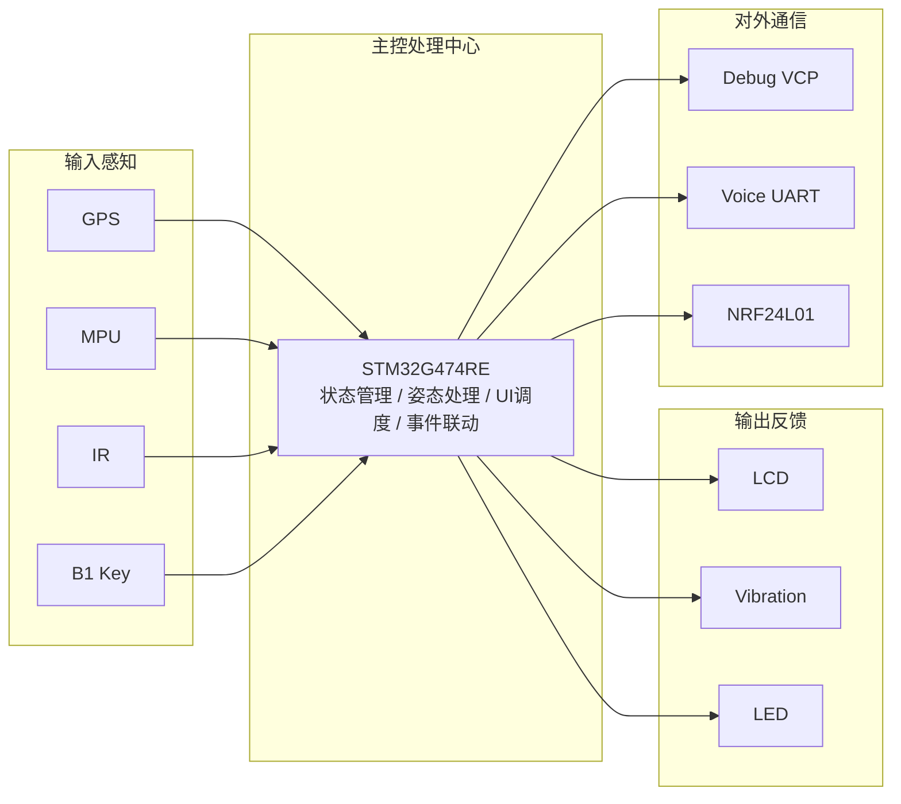
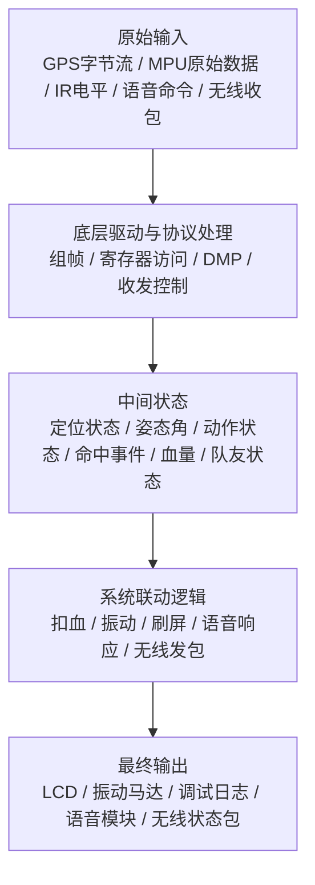
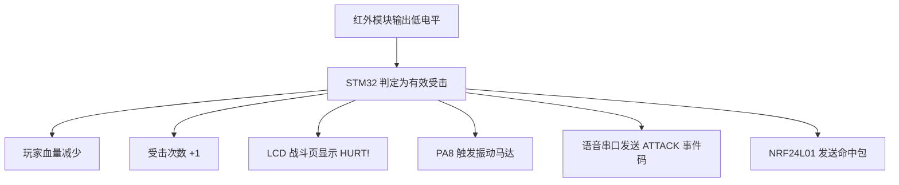
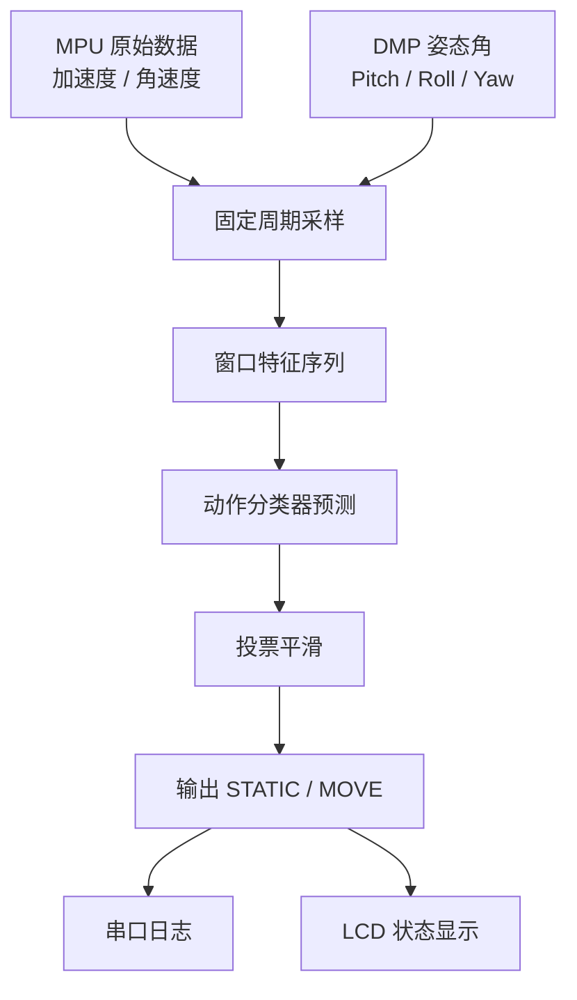
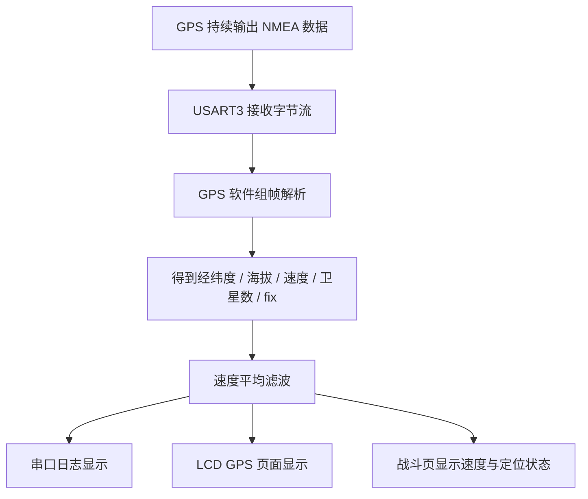
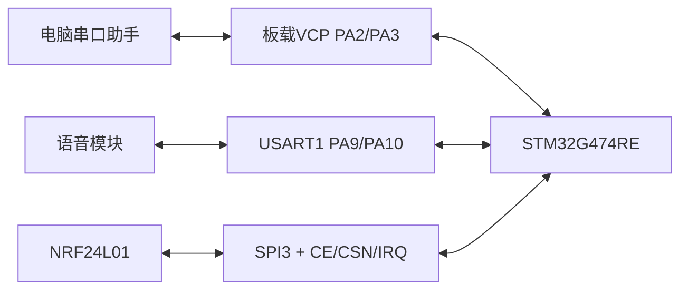

# Mermaid 系统总览与数据流图

下面这份把系统总览、数据流、受击事件链和动作识别链路都用 `Mermaid` 画出来，更适合答辩展示。

## 一、系统总览图

```mermaid
flowchart LR
    subgraph IN["输入感知"]
        GPS["GPS"]
        MPU["MPU"]
        IR["IR"]
        KEY["B1 Key"]
    end

    subgraph CORE["主控处理中心"]
        MCU["STM32G474RE<br/>状态管理 / 姿态处理 / UI调度 / 事件联动"]
    end

    subgraph OUT["输出反馈"]
        LCD["LCD"]
        VIB["Vibration"]
        LED["LED"]
    end

    subgraph COMM["对外通信"]
        DBG["Debug VCP"]
        VOICE["Voice UART"]
        NRF["NRF24L01"]
    end

    GPS --> MCU
    MPU --> MCU
    IR --> MCU
    KEY --> MCU

    MCU --> LCD
    MCU --> VIB
    MCU --> LED
    MCU --> DBG
    MCU --> VOICE
    MCU --> NRF
```

## 二、主数据流图

```mermaid
flowchart TD
    A["原始输入<br/>GPS字节流 / MPU原始数据 / IR电平 / 语音命令 / 无线收包"]
    B["底层驱动与协议处理<br/>组帧 / 寄存器访问 / DMP / 收发控制"]
    C["中间状态<br/>定位状态 / 姿态角 / 动作状态 / 命中事件 / 血量 / 队友状态"]
    D["系统联动逻辑<br/>扣血 / 振动 / 刷屏 / 语音响应 / 无线发包"]
    E["最终输出<br/>LCD / 振动马达 / 调试日志 / 语音模块 / 无线状态包"]

    A --> B --> C --> D --> E
```

## 三、受击事件闭环图

```mermaid
flowchart TD
    IR["红外模块输出低电平"]
    DET["STM32 判定为有效受击"]
    HP["玩家血量减少"]
    CNT["受击次数 +1"]
    LCD["LCD 战斗页显示 HURT!"]
    VIB["PA8 触发振动马达"]
    VOI["语音串口发送 ATTACK 事件码"]
    NRF["NRF24L01 发送命中包"]

    IR --> DET
    DET --> HP
    DET --> CNT
    DET --> LCD
    DET --> VIB
    DET --> VOI
    DET --> NRF
```

## 四、动作识别链路图

```mermaid
flowchart TD
    RAW["MPU 原始数据<br/>加速度 / 角速度"]
    DMP["DMP 姿态角<br/>Pitch / Roll / Yaw"]
    SAMPLE["固定周期采样"]
    FEAT["窗口特征序列"]
    CLS["动作分类器预测"]
    VOTE["投票平滑"]
    OUT["输出 STATIC / MOVE"]
    LOG["串口日志"]
    LCD["LCD 状态显示"]

    RAW --> SAMPLE
    DMP --> SAMPLE
    SAMPLE --> FEAT --> CLS --> VOTE --> OUT
    OUT --> LOG
    OUT --> LCD
```

## 五、GPS 信息链路图

```mermaid
flowchart TD
    GPS["GPS 持续输出 NMEA 数据"]
    UART["USART3 接收字节流"]
    PARSE["GPS 软件组帧解析"]
    STATE["得到经纬度 / 海拔 / 速度 / 卫星数 / fix"]
    FILTER["速度平均滤波"]
    DBG["串口日志显示"]
    LCD["LCD GPS 页面显示"]
    BATTLE["战斗页显示速度与定位状态"]

    GPS --> UART --> PARSE --> STATE --> FILTER
    FILTER --> DBG
    FILTER --> LCD
    FILTER --> BATTLE
```

## 六、通信关系图

```mermaid
flowchart LR
    PC["电脑串口助手"] <--> VCP["板载VCP PA2/PA3"]
    VCP <--> MCU["STM32G474RE"]
    VOICE["语音模块"] <--> UART1["USART1 PA9/PA10"]
    UART1 <--> MCU
    NRFM["NRF24L01"] <--> SPI3["SPI3 + CE/CSN/IRQ"]
    SPI3 <--> MCU
```
